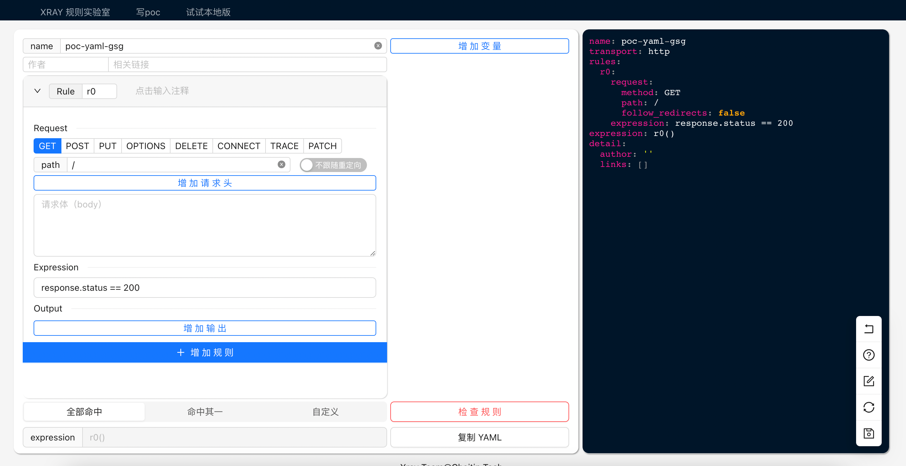

# GAMMA-GUI （Xray POC generator)

## 描述
本项目开源网页版代码，试用：https://poc.xray.cool 。

https://stack.chaitin.com/tool/detail?id=91

release 中有 本地版本

### 技术内容

使用 react + antdesign 开发

本人业余前端，前端业余，本项目只为降低 poc 编写的入门成本

## 运行

安装依赖：`npm i`

编译：`npm run build`

开发调试： `npm start`

## 配置

项目中使用 proxy， 在package.json中配置

项目检查规则请求可以自行修改为自定义的接口

## view

